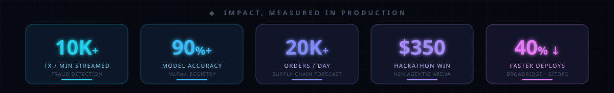

<!-- ================= HERO ================= -->

 

<!-- ================= MANIFESTO ================= -->

### ❝ The best way to predict the future is to build it — in production. ❞

I'm **Sai Kiran Reddy** — a final-year CSE engineer at Lovely Professional University who treats data as raw material and intelligence as the product. I take streaming firehoses, turn them into decisions, and wrap those decisions in agents that act on their own. Everything I build answers one question: *does it hold up when nobody is watching?* Based in Bangalore, building for the world.

 

**◆ What I believe**

> **Data is only valuable the instant it becomes a decision.** Pipelines are plumbing — intelligence is the point.

> **Autonomy beats automation.** A script follows steps; an agent decides, acts, and recovers. I build the second kind.

> **Ship the hard 90%.** A demo that wows judges and a system that survives 10,000 transactions a minute are different animals. I care about the second.

<!-- ================= ARCHITECTURE ================= -->

## ◆ &nbsp; The system I ship

Raw events in, autonomous decisions out — the exact stack behind my real-time work.

 

<!-- ================= IMPACT METRICS ================= -->

<!-- ================= BUILDING ================= -->

## ◆ &nbsp; What I'm building

<table>
<tr>
<td width="50%" valign="top">

### ⟢ Real-Time Fraud Detection
Kafka → PySpark streaming → Delta Live Tables, scoring **10,000+ transactions/min** at **90%+ accuracy**, versioned through MLflow and surfaced live in Power BI.

[`→ view repo`](https://github.com/saikiranreddy18/AI-Powered-Real-Time-Fraud-Detection-System)

</td>
<td width="50%" valign="top">

### ⟢ Self-Healing Kubernetes
Prometheus signals feed an anomaly engine that predicts SLO breaches and **restarts, scales, and rolls back on its own** — zero human touch.

[`→ view repo`](https://github.com/saikiranreddy18/AI-Powered-Autonomous-Self-Healing-Kubernetes-Reliability-Platform)

</td>
</tr>
<tr>
<td width="50%" valign="top">

### ⟢ Agri Intelligence — Capstone
FinBERT sentiment across **Hindi · Telugu · English** fused with CatBoost for a 7-day price horizon at **82.57% accuracy**, auto-refreshed via n8n.

[`→ view repo`](https://github.com/saikiranreddy18/Capstone-Agri_cat)

</td>
<td width="50%" valign="top">

### ⟢ Supply-Chain Forecasting
Prophet + XGBoost over **20,000+ orders/day** with an LP optimizer that cut stock-outs by **~20%**, served on Kubernetes.

[`→ view repo`](https://github.com/saikiranreddy18/AI-Powered-Supply-Chain-Demand-Forecasting-Optimization-Platform)

</td>
</tr>
</table>

<!-- ================= TOOLKIT ================= -->

## ◆ &nbsp; The toolkit

Deliberately full-stack across the data-to-intelligence path — the interesting problems live in the seams.

 

 

▹ currently going deeper on &nbsp;—&nbsp; LLM fine-tuning · LangGraph agents · Databricks Unity Catalog · State Space Models

<!-- ================= PROOF ================= -->

## ◆ &nbsp; Proof, not promises

<table>
<tr>
<td width="50%" valign="top">

**🏆 &nbsp;$350 Winner — N8N Agentic Arena, 2025**
Built and deployed a live autonomous multi-step reasoning agent that ran end-to-end with zero human intervention.

**🥈 &nbsp;2nd Place — IBM Data-thon, 2024**
Shipped a large-scale ML pipeline against top teams nationwide and presented it to IBM judges.

</td>
<td width="50%" valign="top">

**⚡ &nbsp;Broadridge Financial — DevOps & Data Infra Intern** *(2025)*
Cut deployment cycle time **40%** with Jenkins + GitOps, containerized **5+** microservices on Kubernetes with zero downtime, dropped infra provisioning **60%** via Terraform, and lowered MTTD **35%** with Grafana + Datadog.

</td>
</tr>
</table>

◈ Certified &nbsp;—&nbsp; Databricks Fundamentals · IBM Big Data · UiPath Automation Developer · GeeksForGeeks DSA

<!-- ================= SIGNALS ================= -->

## ◆ &nbsp; Signals

&nbsp;

  

 

<!-- ================= CONNECT ================= -->

## ◆ &nbsp; Let's build something

I'm open to **data engineering, AI, and SRE roles** — remote, worldwide — and to collaborators working on agentic AI, LLMs, and real-time data. If it lives at the intersection of data and intelligence, I want in.

 

&nbsp;

&nbsp;

&nbsp;

 

⭐ a star means the world — let's build something great together.

